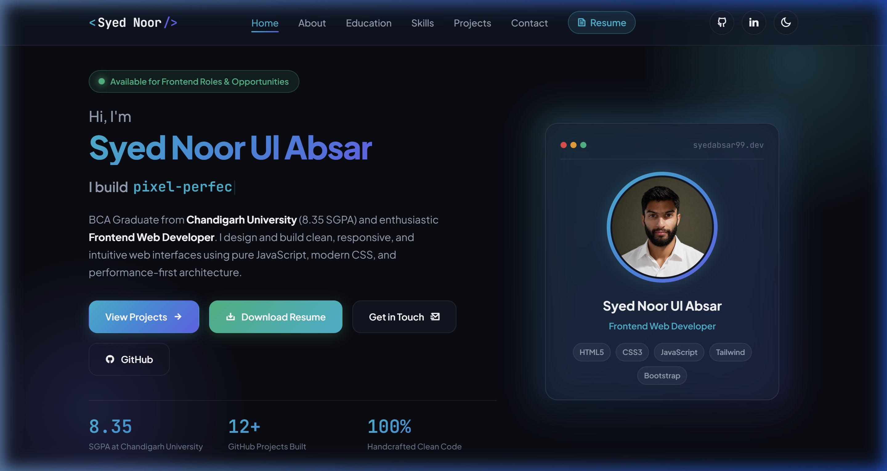

# Syed Noor Ul Absar — Frontend Web Developer Portfolio

A modern, high-performance developer portfolio and single-page ATS curriculum vitae built with pure, human-written Vanilla JavaScript, responsive CSS3, and semantic HTML5.

[](https://syedabsar99.github.io/portfolio/)
[](script.js)
[](style.css)
[](LICENSE)

---

## Preview



> **Live Demo:** [syedabsar99.github.io/portfolio](https://syedabsar99.github.io/portfolio/)

---

## Overview

Designed and crafted by **Syed Noor Ul Absar**, a frontend developer and Bachelor of Computer Applications (BCA) graduate from **Chandigarh University** (8.35 SGPA).

This portfolio showcases real-world web applications, interactive utilities, and responsive landing pages without relying on heavy frameworks or bloated abstractions. It demonstrates core frontend fundamentals: clean DOM manipulation, asynchronous REST API integration, browser storage persistence, and accessible UI engineering.

---

## Key Features

- **Hash-Based SPA Multi-Page Routing** — Native Vanilla JS router (`#home`, `#about`, `#education`, `#skills`, `#projects`, `#contact`) enabling smooth client-side page transitions with browser history support (Back/Forward navigation).
- **Synchronized Typewriter Intro** — Humanized dynamic headline animation synchronized with introductory hero copy.
- **Real-Time Project Search & Filtering** — Live search bar filtering 12+ projects by keyword, technology, or category with real-time matching counter badges and empty-state fallback.
- **Recruiter Snapshot Card** — 30-second hiring overview highlighting availability (Immediate Joiner), work models (Remote / Hybrid / Relocation), and core competencies.
- **Integrated ATS-Optimized Single-Page Resume** — Complete standalone CV ([resume.html](resume.html)) with clean typography, A4 print layout, and direct PDF download ([resume.pdf](resume.pdf)).
- **Direct WhatsApp & Telegram Integration** — 1-click messaging triggers (`+91 9622497806`) featuring dynamic message pre-fill that synchronizes typed inquiries directly to WhatsApp.
- **1-Click Clipboard Copy** — Instant copy buttons for direct phone and email with animated "Copied!" feedback tooltips.
- **Functional Contact Form** — Validated contact form connected to FormSubmit AJAX for direct Gmail inbox delivery, backed by instant messaging fallbacks.
- **Persistent Dark / Light Theme** — Tailored HSL color system with glassmorphism effects, high-contrast badges, and LocalStorage state persistence.
- **Mobile-First Responsive Layout** — Optimized for all viewports from 320px mobile screens to large desktop monitors.

---

## Tech Stack

| Layer | Technologies | Key Highlights |
| :--- | :--- | :--- |
| **Structure** | HTML5 | Semantic elements (`<main>`, `<nav>`, `<section>`, `<article>`), ARIA labels, Open Graph & SEO metadata |
| **Styling** | Modern CSS3 (Vanilla) | CSS custom properties (variables), Glassmorphism (`backdrop-filter`), CSS Grid, Flexbox, keyframe animations, `@media print` |
| **Logic** | Vanilla JavaScript (ES6+) | Native DOM traversal, hashchange routing, Fetch API, LocalStorage API, Clipboard API, regular expressions |
| **Typography & Icons** | Google Fonts & Remix Icon | Plus Jakarta Sans, JetBrains Mono, Remix Icon vector icon library |
| **Hosting & CI/CD** | GitHub Pages & Vercel | Production CDN deployment, HTTPS termination, zero build step overhead |

---

## Featured Projects Highlighted

| Project | Category | Tech Stack | Live Demo | Source Code |
| :--- | :--- | :--- | :--- | :--- |
| **Music Player** | JavaScript App | HTML5, CSS3, Audio API, JS | [Live Demo](https://syedabsar99.github.io/music-player/) | [GitHub](https://github.com/syedabsar99/music-player) |
| **Weather Dashboard** | JavaScript App | OpenWeather API, Fetch, JS | [Live Demo](https://syedabsar99.github.io/weather-dashboard/) | [GitHub](https://github.com/syedabsar99/weather-dashboard) |
| **Notes App** | JavaScript App | LocalStorage, Theme Picker, JS | [Live Demo](https://syedabsar99.github.io/notes-app/) | [GitHub](https://github.com/syedabsar99/notes-app) |
| **To-Do List App** | JavaScript App | DOM Events, LocalStorage, JS | [Live Demo](https://syedabsar99.github.io/todo-list-app/) | [GitHub](https://github.com/syedabsar99/todo-list-app) |
| **QR Code Generator** | JavaScript App | QR API, Canvas, Download, JS | [Live Demo](https://syedabsar99.github.io/qr-code-generator/) | [GitHub](https://github.com/syedabsar99/qr-code-generator) |
| **Live Words Counter** | JavaScript App | Regex Tokenizer, Text Metrics, JS | [Live Demo](https://syedabsar99.github.io/live-words-counter/) | [GitHub](https://github.com/syedabsar99/live-words-counter) |
| **Age Calculator** | JavaScript App | Date API, Validation, JS | [Live Demo](https://syedabsar99.github.io/age-calculator/) | [GitHub](https://github.com/syedabsar99/age-calculator) |
| **Password Generator** | JavaScript App | Crypto API, Clipboard, JS | [Live Demo](https://syedabsar99.github.io/random-password-generator/) | [GitHub](https://github.com/syedabsar99/random-password-generator) |
| **Kashmir Shawl Store** | Landing Page | Semantic HTML, CSS3, Responsive | [Live Demo](https://kashmir-shawl-store.vercel.app) | [GitHub](https://github.com/syedabsar99/kashmir-shawl-store) |
| **Glozin Theme Clone** | UI Clone | Bootstrap 5, Flexbox, Sliders | [Live Demo](https://syedabsar99.github.io/glozin-theme-clone/) | [GitHub](https://github.com/syedabsar99/glozin-theme-clone) |
| **Hotel Zante Clone** | UI Clone | Bootstrap 5, Responsive Grid | [Live Demo](https://syedabsar99.github.io/hotel-zante-clone/) | [GitHub](https://github.com/syedabsar99/hotel-zante-clone) |
| **Real Estate Landing** | Landing Page | Bootstrap 5, Modern Layout | [Live Demo](https://syedabsar99.github.io/real-estate-landing-page/) | [GitHub](https://github.com/syedabsar99/real-estate-landing-page) |

---

## Project Structure

```text
portfolio/
├── assets/
│   ├── preview.png              # High-resolution portfolio showcase image
│   └── syed-portrait.jpg        # Developer portrait photo
├── .gitignore                   # Standard version control exclusions
├── index.html                   # Core single-page application & routing views
├── LICENSE                      # Open-source MIT License
├── README.md                    # Comprehensive repository documentation
├── resume.html                  # Single-page ATS-formatted printable curriculum vitae
├── resume.pdf                   # Pre-compiled high-ATS score PDF resume
├── script.js                    # SPA routing, search, typewriter, clipboard, form handler
└── style.css                    # Complete design system, themes, and responsive rules
```

---

## Getting Started

No build tools, bundlers, or package installations are required.

### 1. Clone the repository
```bash
git clone https://github.com/syedabsar99/portfolio.git
```

### 2. Open locally
Open `index.html` directly in your web browser:
```bash
cd portfolio
start index.html
```

Or serve via any static HTTP server (e.g., Live Server in VS Code, `npx serve`, or Python):
```bash
python -m http.server 8080
```

---

## Author & Contact

**Syed Noor Ul Absar**
- **Role**: Frontend Web Developer
- **Education**: Bachelor of Computer Applications (BCA), Chandigarh University (8.35 SGPA)
- **Location**: Budgam, Jammu & Kashmir, India - 191111
- **Phone / WhatsApp**: [+91 9622497806](https://wa.me/919622497806)
- **Telegram**: [t.me/+919622497806](https://t.me/+919622497806)
- **Email**: [syedabsar99@gmail.com](mailto:syedabsar99@gmail.com)
- **GitHub**: [@syedabsar99](https://github.com/syedabsar99)
- **LinkedIn**: [linkedin.com/in/syednoorulabsar](https://www.linkedin.com/in/syednoorulabsar/)

---

## License

This project is licensed under the [MIT License](LICENSE) — feel free to reference the code structure for your own projects.
